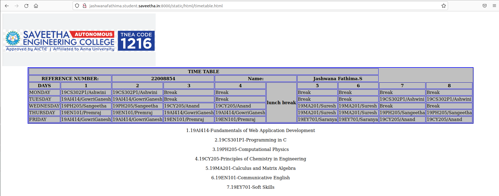

# Experiment_Time_Table

## AIM
To Write a html webpage page to display your timetable.

# ALGORITHM
### STEP 1
create a simple table using table tag
### STEP 2
Add header row using th tag
### STEP 3
Add your timetable
### STEP 4
Execute the program

# CODE
```
<!DOCTYPE html>
<html lang="en">
<body>

<table border = "2" cellspacing="2" bordercolor="blue"
bgcolor="silver" align="center">
<tr>
<th colspan="8">TIME TABLE</th>
</tr>
<th colspan=2>REFERENCE NUMBER:</th>
<th colspan=2>22008854</th>
<th colspan=2>Name:</th>
<th colspan=2>Jashwana Fathima.S</th>
</tr>
<tr>
<th>DAYS</th>
<th>1</th>
<th>2</th>
<th>3</th>
<th>4</th>
<th rowspan="8">lunch break</th>
<th>5</th>
<th>6</th>
<th>7</th>
<th>8</th>
</tr>
<tr>
<td>MONDAY</td>
<td>19CS302P1/Ashwini</td>
<td>19CS302P1/Ashwini</td>
<td>Break</td>
<td>Break</td>
<td>Break</td>
<td>Break</td>
<td>Break</td>
<td>Break</td>
</tr>
<tr>
<td>TUESDAY</td>
<td>19AI414/GowriGanesh</td>
<td>19AI414/GowriGanesh</td>
<td>Break</td>
<td>Break</td>
<td>Break</td>
<td>Break</td>
<td>19CS302P1/Ashwini</td>
<td>19CS302P1/Ashwini</td>
</tr>
<tr>
<td>WEDNESDAY</td>
<td>19PH205/Sangeetha</td>
<td>19PH205/Sangeetha</td>
<td>19CY205/Anand</td>
<td>19CY205/Anand</td>
<td>19MA201/Suresh</td>
<td>19MA201/Suresh</td>
<td>Break</td>
<td>Break</td>
</tr>
<tr>
<td>THURSDAY</td>
<td>19EN101/Premraj</td>
<td>19EN101/Premraj</td>
<td>19AI414/GowriGanesh</td>
<td>19AI414/GowriGanesh</td>
<td>19MA201/Suresh</td>
<td>19MA201/Suresh</td>
<td>19PH205/Sangeetha</td>
<td>19PH205/Sangeetha</td>
</tr>
<tr>
<td>FRIDAY</td>
<td>19AI414/GowriGanesh</td>
<td>19AI414/GowriGanesh</td>
<td>19EN101/Premraj</td>
<td>19EN101/Premraj</td>
<td>19EY701/Saranya</td>
<td>19EY701/Saranya</td>
<td>19CY205/Anand</td>
<td>19CY205/Anand</td>
</tr>
</table>
<p align="center">1.19AI414-Fundamentals of Web Application Development</p>
<p align="center">2.19CS301P1-Programming in C</p>
<p align="center">3.19PH205-Computational Physics</p>
<p align="center">4.19CY205-Principles of Chemistry in Engineering</p>
<p align="center">5.19MA201-Calculus and Matrix Algebra</p>
<p align="center">6.19EN101-Communicative English</p>
<p align="center">7.19EY701-Soft Skills</p>
</body>
</html>
```

# OUPUT


# RESULT
Thus the timetable is displayed in a webpage.
